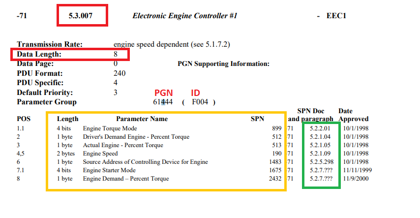
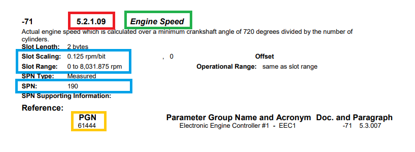

## Parsing text from pdf

**Программа создана для парсинга данных из pdf файла в соответствии с техническим заданием заказчика "Транспортная компания «О2RUS»".**

Для запуска программы необходимо использовать Python 3. 
Перед запуском программы необходимо:
- Установить зависимости из файла requirements.txt. 
- Создать базу данных. 
- Файл "env.example", находящийся в папке "env", переименовать в ".env" и заполнить соответствующие поля.

Программа запускается из файла main.py.

Исходный PDF файл находится в папке "raw_files". 
Программа создана для чтения конкретного файла с названием "SAE J1939-71.pdf".

Программа для чтения PDF файла использует библиотеку fitz.
С помощью указанной библиотеки программа считывает из файла весь имеющийся текст.
Для очистки текста от повторяющихся элементов используются Регулярные выражения.
Работа с базой данных осуществляется с использованием библиотеки SQLAlchemy.

В соответствии с заданием получаем данные разделов 5.3.* и параграфов 5.2.* согласно выделенным фрагментам рисунков ниже.

Все полученные данные загружаются в базу данных.
При каждом запуске программы база данных очищается и заново записываются данные из PDF файла.

После запуска программы пользователю будет предложено ввести необходимые для поиска параметры (номер раздела, номер параграфа, имя параметра).

Результатом поиска является найденный раздел (разделы) со своими параметрами и связанные с ним (ними) параграф (параграфы) со своими данными.

Успешного использования программы "Parsing text from pdf".
